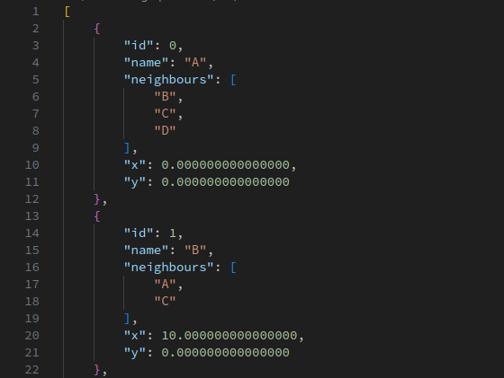

# waypoint_tools



A ROS2 utility package to interactively record waypoints based on the robot's odometry and save them to a JSON file.

## [View Demo Video](https://drive.google.com/file/d/1KklIigYbCunJCCx7AhKZNd6-13tMK6ji/view?usp=sharing)


---

## 📦 Features

- Subscribes to odometry and logs robot's current 2D pose.
- Lets user name waypoints(#TODO) and assign neighbours interactively via terminal.
- Stores waypoint info as a structured JSON file (`waypoints.json`).
- Parameterized topic name and waypoint limit.


## 🛠️ Build Instructions

```bash
cd ~/ros2_ws/src
git clone https://github.com/manojm-dev/waypoint_tools.git
cd ..
colcon build --packages-select waypoint_tools
source install/setup.bash
```

## 📦 Installing Dependencies

```
cd ~/ros2_ws
sudo apt-get update -y && rosdep update && rosdep install --from-paths src --ignore-src -y
```


## 🚀 Run the Node

```bash
ros2 run waypoint_tools waypoint_recorder_node 
```

## 👨‍💻 Author
Made with ❤️ by Manoj M